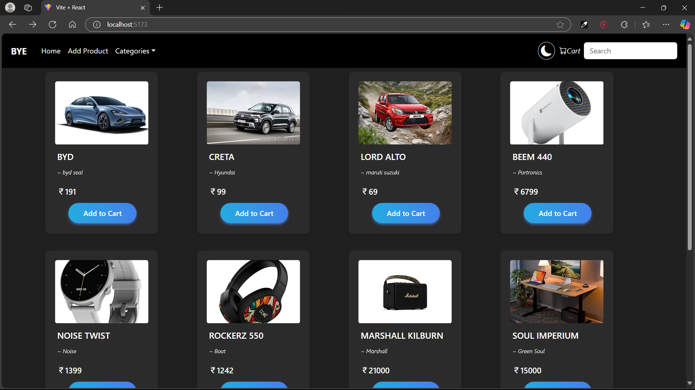
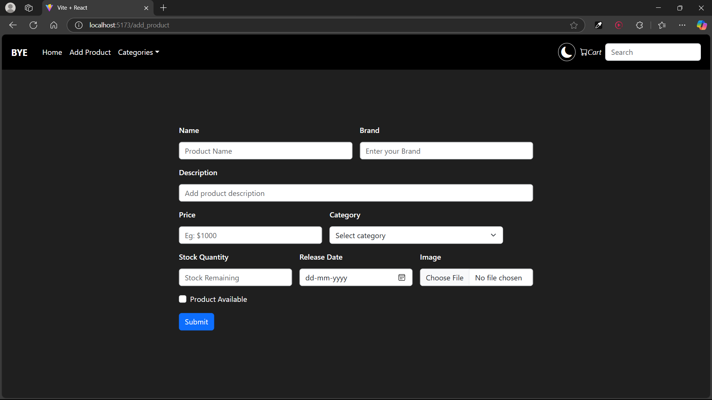
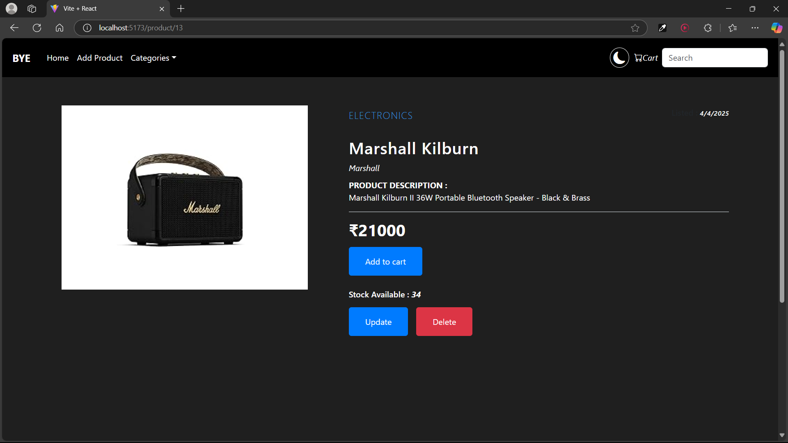
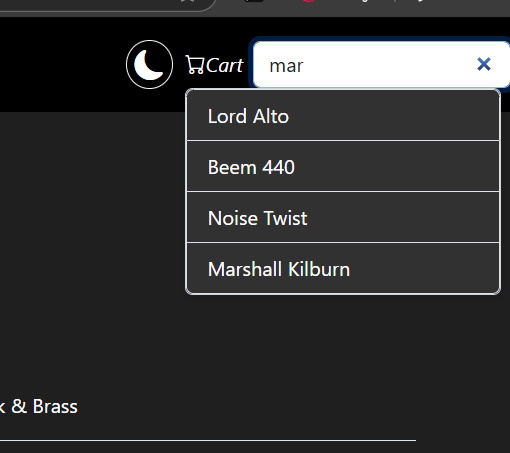

# BYE---e_store
# 🛒 E-Commerce App – Spring Boot + React

BYE-e_store is a backend + frontend service for an e-commerce platform, built using Java, Spring Boot framework and React. The project is structured to provide a robust foundation for managing products and supporting typical e-commerce operations.

---

## 🔥 Features


- 🛍️ **Product Listing** (Add, Update, Delete by Admin)
- 🛒 **Add to Cart** (Customer specific)
- 📦 Backend: Spring Boot + JPA + MySQL
- 🖼️ Frontend: React + Tailwind CSS

---

## 📸 Screenshots

### 🛍️ Product Listing (Customer)


---

### 🧑‍💻 Add Products


---

###  Product View


---

###  Search



## ⚙️ Tech Stack

| Frontend       | Backend         | Database |
|----------------|-----------------|----------|
| React + Tailwind CSS | Spring Boot + Spring data jpa| MySQL    |

---

## 📦 Run Locally

```bash
# Backend
cd backend
./mvnw spring-boot:run

# Frontend
cd frontend
npm install
npm run dev
